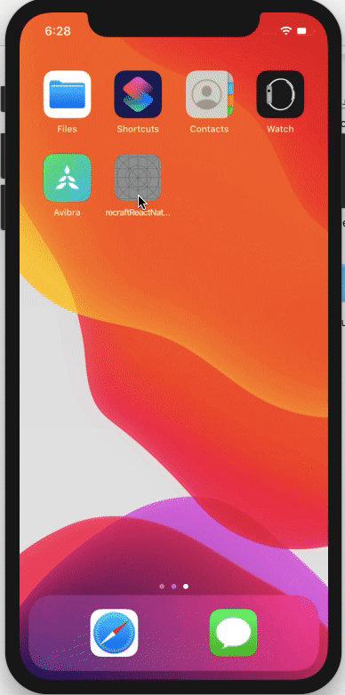

<p align="center"></p>]https://github.com/recraftrelic/recraft-attendance-app)

<h1 align="center">Recraft Crafter Hub Attendance App</h1>

<p align="center">Recraft crafter hub attendance app</p>

IOS Demo
=======
<p align="center">
  
</p>

Android Demo
=======
<p align="center">
  
</p>

Packages & Libraries used
=======

* [React Native](https://www.npmjs.com/package/react-native) - A framework for building native apps with React.
* [React](https://www.npmjs.com/package/react) - A declarative, efficient, and flexible JavaScript library for building user interfaces.
* [React router native](https://www.npmjs.com/package/react-router-native) - Declarative routing for React.
* [moment](https://www.npmjs.com/package/moment) - Parse, validate, manipulate, and display dates in javascript.
* [TypeScript](https://www.npmjs.com/package/typescript) - TypeScript is a superset of JavaScript that compiles to clean JavaScript output.

Steps to Run the Project in Development Mode
=======
Use the Below Commands to Clone the project and enter inside the Directory
After that Install the Dependencies.
```
git clone https://github.com/recraftrelic/recraft-attendance-app.git
cd recraft-attendance-app
yarn install
```

### IOS
We can directly run the app
```
npx react-native run-ios
```

### Facing any error related to pods in ios
We need to install the pods
```
sudo gem install cocoapods
cd ios
pod install
cd ..
npx react-native run-ios
```

### Android
We can directly run the app
```
npx react-native run-android
```

Note
=======

> Once you clone and if you want to change the name of the application you can follow this article https://medium.com/the-react-native-log/how-to-rename-a-react-native-app-dafd92161c35

Roadmap
=======

* Move all the lists to constants
* Deploy to playstore
* Implement internationalization
* Improve documentation

Contributors
=======
* [manojsinghnegiwd](https://github.com/manojsinghnegiwd) - Manoj Singh Negi
* [rocksinghajay](https://github.com/rocksinghajay) - Ajay Singh

Sponsors
=======
[](http://www.recraftrelic.com)
